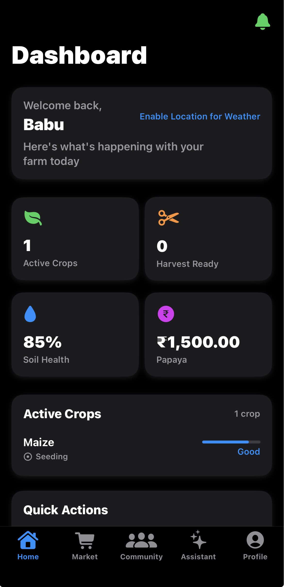

# 📚 README - Wiki Documentation

This directory contains the comprehensive wiki documentation for AgriSense iOS.

---

## 📖 Available Wiki Pages

### Getting Started
- **[Home](Home.md)** - Main wiki homepage with navigation
- **[Installation Guide](Installation-Guide.md)** - Complete setup instructions
- **[Quick Start](Quick-Start.md)** - Get started in 5 minutes
- **[FAQ](FAQ.md)** - Frequently asked questions

### Architecture & Development
- **[Project Architecture](Project-Architecture.md)** - System design and patterns
- **[Live AI Assistant](Live-AI-Assistant.md)** - Krishi AI deep dive
- **[Contributing](Contributing.md)** - How to contribute
- **[Testing Guide](Testing-Guide.md)** - Testing documentation

---

## 🌐 Publishing to GitHub Wiki

To publish these pages to GitHub Wiki:

### Method 1: Clone Wiki Repository

```bash
# Clone the wiki repository
git clone https://github.com/Athar891/AgrisenseiOS.wiki.git

# Copy wiki files
cp wiki/*.md AgrisenseiOS.wiki/

# Commit and push
cd AgrisenseiOS.wiki
git add .
git commit -m "Add comprehensive wiki documentation"
git push origin master
```

### Method 2: Manual Upload

1. Go to https://github.com/Athar891/AgrisenseiOS/wiki
2. Click "New Page" for each wiki page
3. Copy content from markdown files
4. Save each page

### Method 3: Use GitHub Web Interface

1. Enable GitHub Wiki in repository settings
2. Clone wiki repo as shown in Method 1
3. Push all markdown files

---

## 📝 Adding New Wiki Pages

To add a new wiki page:

1. **Create markdown file** in `wiki/` directory:
   ```bash
   touch wiki/New-Page-Name.md
   ```

2. **Add content** following existing page structure

3. **Update Home.md** with link to new page:
   ```markdown
   - **[New Page Name](New-Page-Name.md)** - Description
   ```

4. **Commit and push**:
   ```bash
   git add wiki/New-Page-Name.md wiki/Home.md
   git commit -m "docs: add New Page Name wiki page"
   git push origin main
   ```

5. **Sync to GitHub Wiki** (if using separate wiki repo)

---

## 🎨 Wiki Style Guide

### Page Structure

```markdown
# 📚 Page Title

Brief description of the page content.

---

## 📋 Table of Contents

- [Section 1](#section-1)
- [Section 2](#section-2)

---

## 🎯 Section 1

Content here...

### Subsection

More detailed content...

---

## 📚 Related Documentation

- [Link to related page](Related-Page.md)

---

**Questions?** [Create an issue](...)
```

### Emojis for Sections

Use consistent emojis for section types:
- 📋 Table of Contents
- 🎯 Overview/Goals
- 🏗 Architecture
- 🔧 Configuration
- 💻 Code Examples
- 🐛 Troubleshooting
- ⚡ Quick Tips
- 📚 References
- ❓ FAQ
- 🚀 Getting Started
- ✅ Best Practices

---

## 🔗 Internal Linking

Use relative links for internal wiki pages:

```markdown
See [Installation Guide](Installation-Guide.md) for details.
```

For sections within same page:
```markdown
Jump to [Architecture](#architecture) section.
```

---

## 📸 Images

Store images in `Screenshots/` directory:

```markdown

```

---

## 🎯 Maintenance

### Keeping Wiki Updated

- Update when adding new features
- Fix broken links regularly
- Keep code examples current
- Update version numbers
- Review and update FAQs

### Regular Reviews

Schedule quarterly reviews to:
- ✅ Verify all links work
- ✅ Update outdated information
- ✅ Add missing documentation
- ✅ Improve clarity
- ✅ Add recent FAQs

---

## 📞 Support

For wiki-related questions or suggestions:
- Open an issue on GitHub
- Submit a pull request with improvements
- Contact: support@agrisense.app

---

**Start exploring**: [Home](Home.md)
